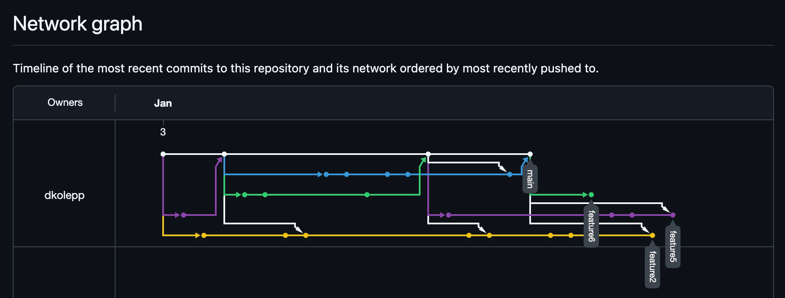
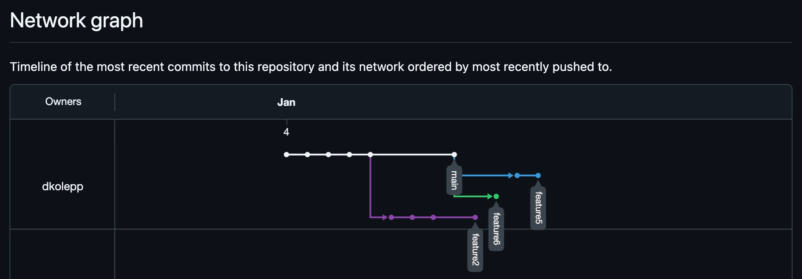
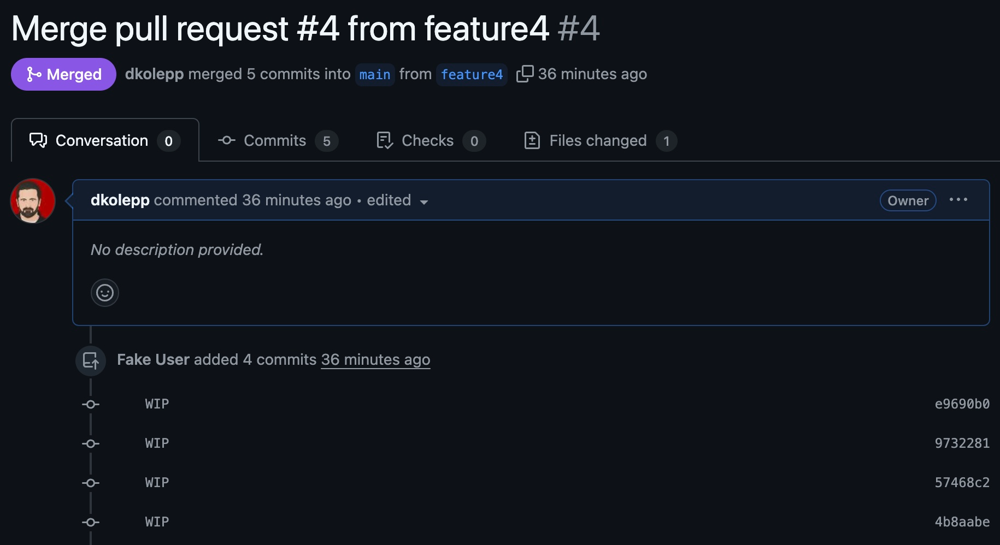
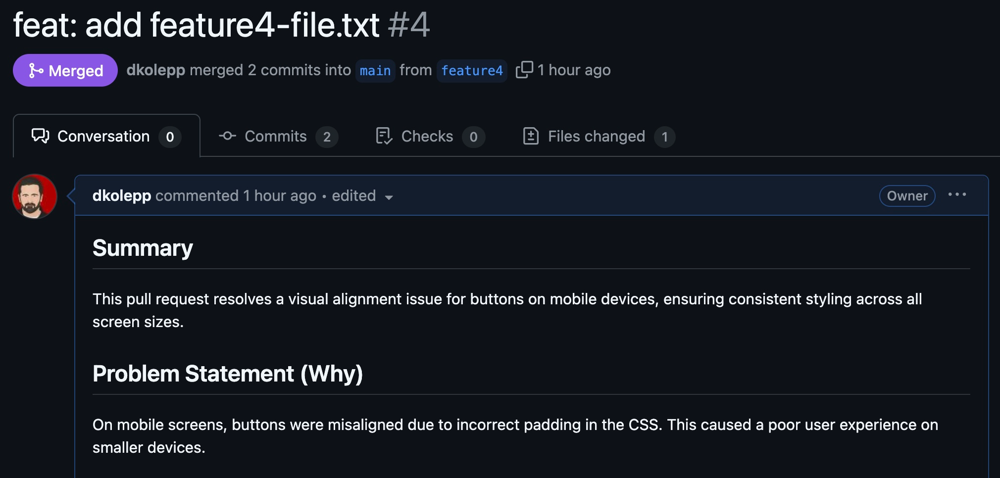
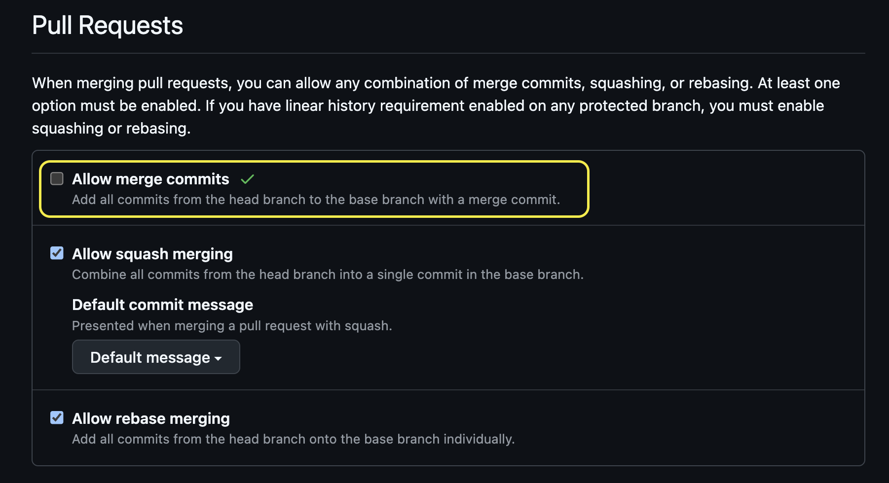

+++
date = '2025-01-13T11:33:18-05:00'
draft = false
title = 'Effective Git Practices'
featuredImage = "/images/technology/effective-git-practices.png"
#series = [""]
tags = [
  "tools",
  "techniques",
  "patterns",
  "Convention over Configuration Principle",
  "Go Slow",
  "motion",
  "defects",
  "Social Contract",
]
+++

🔄 *Are your `git` practices today setting you and your team up for success or creating waste tomorrow?*

*In this post, I provide 5️⃣  tips to minimize [**Motion**](/tradecraft/types-of-waste-pt1/#motion) waste, improve collaboration, and
set you and your team up for long-term success.*

<!--more-->

## TL;DR

Unintentional habits can lead to inefficiencies like wasted time, unclear context,
and frustrating troubleshooting—
common forms of  [Motion](/tradecraft/types-of-waste-pt1/#motion) and other Lean wastes.

Transform your `git` workflow with these 5 intentional practices:

1. Don’t allow merge commits on `main`.
2. Rebase branches to main at least once a day. (`git rebase main`)
3. Use conventional commit messages.
4. Document every PR (quickly and clearly).
5. Keep PRs singularly focused; practice PR "refactoring."


## A Tale of Two Repositories

**IMAGINE:** An issue has been reported in production.

A recent change might be the root cause.
You need to identify the issue, implement a fix, and deploy it as quickly as possible.

Which repository below (A or B?) helps you accomplish this faster?

**[NOTE: Both repositories have identical code changes]**



{}

**Repo A**

```bash
*   e7de0a4 (HEAD -> main, origin/main) Merge pull request #4 from dkolepp/feature4
|\
| *   7f3e4fb (origin/feature4) Merge main into feature4
| |\
| |/
|/|
* |   8c94bbc Merge pull request #3 from dkolepp/feature3
|\ \
| * | 8c031fe (origin/feature3) WIP
| * | cfe54fb WIP
| * | 6270d2d WIP
|/ /
| * 4b8aabe WIP
| * 57468c2 WIP
...output omitted...
```

**Repo B**

```bash
git log --oneline --graph
* ac4b4fc (HEAD -> main, origin/main) feat: add feature4-file.txt (#4)
* 59a975c chore: upgrade libxyz to v1.0.1 (#6)
* 01276d2 fix: set correct date in feature3-file.txt (#5)
* 205e70c feat: add feature3-file.txt (#3)
* 09fe419 feat: add feature1-file.txt (#1)
* 5d309de feat(docs): add README.md
```

{}

{}

**Repo A**



**Repo B**



{}

{}

#### Repo A



#### Repo B



{}





## Tips for Effective Git Practices

These are organized from easiest to implement, to requires "regular practice".

### 1. No Merge Commits on Main

Configure your repository to enforce a linear history by disallowing merge commits on the `main` branch.
This keeps the commit history clean, easy to trace, and
more useful for debugging and understanding changes over time.

#### How to Disallow Merge Commits

To do this on GitHub (as an example):

1. Navigate to your repository settings.
2. Uncheck the **`Allow merge commits`** option under the "Merge button" settings.



This ensures your repository history remains (mostly) linear, improving readability and simplifying collaboration.

#### Rebase When Pulling

To further enforce a linear history, configure `git pull` to rebase by default instead of merging.
This avoids unnecessary merge commits when syncing with `main`.

Run the following command to update your global `gitconfig`:

```bash
git config --global pull.rebase true
```

### 2. Rebase Daily

Keeping your feature branch up-to-date with `main` is essential for reducing conflicts and
maintaining a clean history.
Instead of using `git merge main`, adopt `git rebase main` to
integrate the latest changes from `main` into your branch.

#### How to Rebase

```console
git checkout main
git pull
git checkout my-feature-branch
git rebase main
```

This process “replays” your branch’s commits on top of the latest changes in `main`,
avoiding unnecessary merge commits and keeping your history linear and easy to follow.

#### Why Rebase?

- Minimizes Conflicts: Rebasing regularly reduces the chances of
  running into large, complex conflicts when merging your branch into main.
- Keeps History Clean: It eliminates cluttered merge commits, making it easier to
  trace changes and understand the evolution of your code.

#### 💡 Pro Tip: Squash Commits During Rebase

If your branch contains work-in-progress (WIP) commits, you can combine them into a single meaningful commit during the rebase process:

1. Use interactive mode:

   ```bash
   git rebase -i main
   ```

2. Mark unnecessary commits with squash or fixup in the interactive editor.
3. Save and close the editor to finalize the rebase.

Squashing commits keeps your branch history concise, avoids clutter, and
reduces repeated conflict resolution during rebasing.
This makes it easier for your team to review and understand your contributions.

### 3. Use Conventional Commits

Adopt the **Conventional Commits** [specification](https://www.conventionalcommits.org/en/v1.0.0/#summary) for your commit messages.
This makes your commit history and pull requests easier to read, understand, and maintain.

#### Why It Matters

- **Clarity**: Structured commit messages provide consistent context for changes,
  making it easier to trace the evolution of your codebase.
- **Automation**: Tools like `git-changelog` or `semantic-release` can use commit messages to
  generate changelogs or determine version bumps automatically.

#### Practical Advice

The first commit on a branch is especially important. In GitHub,
the title of your pull request will default to the message of your first commit.
When your branch is merged, this pull request title will be used as the commit message for the merge.

💡 **Tip:** Before making your first commit on a new branch,
think about the work it represents and craft a meaningful commit message.
Use the Conventional Commits format to ensure clarity and consistency:

```text
<type>(scope): <short summary>
```

### 4. Document Every PR

Write a brief but clear description for every pull request.
Good documentation ensures your changes are easy to understand, review, and maintain over time.

#### What to Include

- **Problem**: What issue or requirement does this PR address?
- **Solution**: How does this PR solve the problem? Provide a high-level summary of the approach.
- **Testing**: Detail any tests performed, including screenshots or logs if applicable.

#### Why It Matters

- Maintains context for long-term understanding of changes.
- Simplifies reviews by providing the information reviewers need upfront.
- Reduces future troubleshooting effort by clearly documenting the purpose and impact of changes.

💡 **Pro Tip:** Automate PR Consistency

On GitHub, you can create a `.github/pull_request_template.md` [file in your repository](https://docs.github.com/en/communities/using-templates-to-encourage-useful-issues-and-pull-requests/creating-a-pull-request-template-for-your-repository#adding-a-pull-request-template).
This file serves as a template for every new pull request,
ensuring consistent documentation across your team.

Here’s an example PR template:

```markdown
## Overview
Describe the issue or requirement this PR addresses.

## Solution
Explain your approach and summarize the key changes.

## Testing
List the tests performed and their results.
Include screenshots, logs, or links to CI builds if applicable.

## Review CheckList
- [ ] Conributions abide by team guidelines
- [ ] All conversations are resolved
```

### 5. Keep PRs Singularly Focused

Ensure each pull request is small and focused on a single change.
Breaking down large changes into smaller, logical PRs reduces review complexity and
makes it easier to identify and address issues if something goes wrong.

#### Why It Matters

- **Simpler Reviews**: Small, focused PRs are easier for your team to review thoroughly.
- **Easier Troubleshooting**: Isolated changes make it straightforward to pinpoint and resolve issues.
- **Safer Reverts**: If a PR contains multiple features and you need to revert it,
  you risk undoing changes that aren’t problematic.
  Singularly focused PRs ensure that only the problematic feature is affected by a revert.

This is often the hardest of the five tips to implement,
especially for teams working on large features or tight deadlines.
Mastering this discipline can significantly improve your development workflow and collaboration.

💡 *I’m planning a separate post to explore techniques for keeping PRs focused—stay tuned!*


## Minimize Motion; Enable Flow

The practices outlined in this post are intentionally opinionated,
designed to achieve specific outcomes like cleaner repositories, smoother collaboration,
and faster CI/CD workflows.

If you don’t have a strong opinion, start with these tips.
If you do, you’re likely already thinking about achieving outcomes like reducing waste,
improving team alignment, and streamlining development processes.

By practicing these, you’ll build intuition and
a deeper understanding of what works for your workflows.
As your team gains experience, experiment with other techniques.
Adapt and evolve your practices to suit your needs,
keeping the focus on reducing waste and achieving better outcomes.

Lastly, these tips are not one-size-fits-all —
they’re context-dependent.

As a team, take the time to discuss the outcomes you’re seeking.
Conversations about `git` conventions and practices are more than just technical—
they’re part of your team’s agreements - or social contract.
These agreements ensure alignment, foster collaboration, and
create shared accountability for maintaining clean and efficient workflows.

Finally, remember the principle of **“Go Slow, to Go Fast.”**
Learning and adopting intentional practices takes time and effort at first,
but this investment will pay off with faster progress, easier troubleshooting, and
fewer frustrations in the long run.


## Related Resources

- **Trunk-Based Development**
  - *[Trunk-Based Development](https://trunkbaseddevelopment.com/)* – A comprehensive guide on the practice and its benefits for modern CI/CD workflows.

- **Conventional Commits**
  - *[Conventional Commits Specification](https://www.conventionalcommits.org/en/v1.0.0/#summary)* – The official documentation for implementing structured commit messages.

- **"Kata" in Software Development**
  - *Kata* is a concept borrowed from martial arts, emphasizing deliberate practice through repetition
    to build skill and mastery.
    In software development, katas are structured exercises designed to improve technical skills
    through consistent practice.
  - *[Eficode Academy Git Katas](https://github.com/eficode-academy/git-katas?tab=readme-ov-file)* – A
    comprehensive collection of hands-on exercises to practice and master `git` workflows,
    including rebasing, conflict resolution, and branching strategies.

- **Social Contracts in Teams**
  - *[How to Create a Team Social Contract](https://openpracticelibrary.com/practice/social-contract/)* – Article from the
    [OpenPractice Library](https://openpracticelibrary.com) on Social Contracts, providing adivce on how to implement one for your team.

- **Git Tips and Tutorials**
  - *[Pro Git](https://git-scm.com/book/en/v2)* – A free, authoritative guide to understanding `git` at a deeper level.
